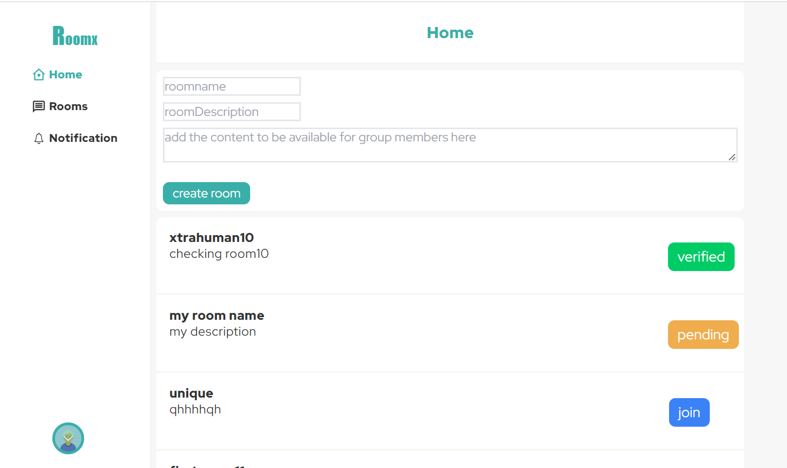
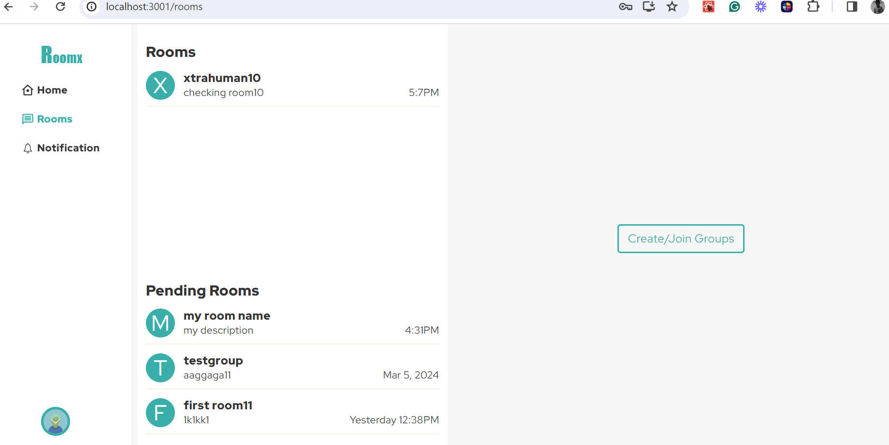
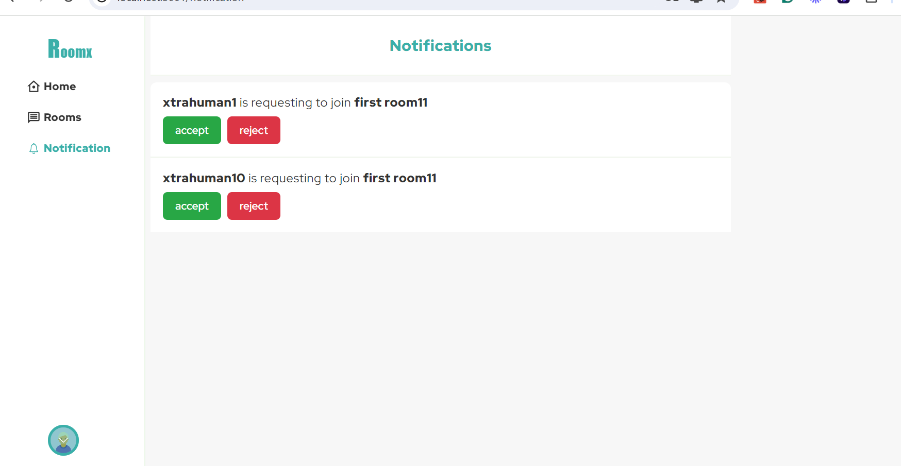
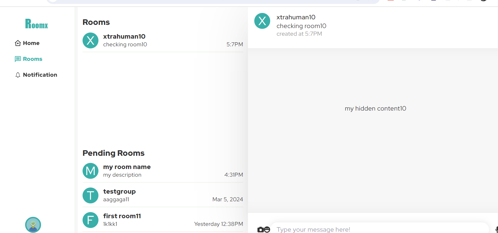

# moderated_room
fullstack building of moderated room. In this project, users become administrators immediately upon creating a room. Other users cannot view the hidden content of a group unless they become members of the group. Users can request to join a room, but only the moderator or administrator can accept the user into the group. A user can belong to several rooms, so the user's role is connected to room membership.


## Project Preview

 home page                               |  user rooms page
:---------------------------------------:|:---------------------------------------:
                     |   


 notification page                       |  rooms details page
:---------------------------------------:|:---------------------------------------:
              |   


### deployed website

>  [pending]() 


### Built With

- [React](https://es.reactjs.org/)
- [express]
- [HTML](https://www.w3schools.com/html/)
- [CSS](https://www.w3schools.com/css/)
- [JS](https://www.javascript.com/)
- [Node.js]

## Project Setup

1. Clone the repository
   ```sh
   git clone https://github.com/xtrahuman/moderated_room.git
   ```

2. Navigate to the root of project
   ```sh
   cd moderated_room
   ```


### Backend Setup

1. Navigate to backend
   ```sh
   cd backend
   ```

2. Install NPM packages for Front-end
   ```sh
   npm install
   ```

3. Run migration to create tables and relation in database
    ```sh
    npx sequelize-cli db:migrate
   ```

4. start application
   ```sh
   npm start
   ```

### Frontend Setup

1. From project root Navigate to Frontend
   ```sh
   cd frontend
   ```

2. Install NPM packages for Front-end
   ```sh
   npm install
   ```

3. start application
   ```sh
   npm start
   ```
## Author

👤 **Okpara Tochukwu**

- GitHub: [@xtrahuman](https://github.com/xtrahuman)
- LinkedIn: [LinkedIn](https://linkedin.com/in/tochukwuokpara)

## 🤝 Contributing

Contributions, issues, and feature requests are welcome!

Feel free to check the [issues page](../../issues/).

## Show your support

Give a ⭐️ if you like this project!
